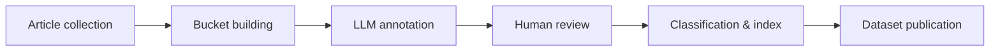

# BENI Pipeline Flow

How raw news articles become a published dataset and economic index.

## Stages

| Stage | What happens | Code / docs |
|-------|--------------|-------------|
| **Article collection** | Contributors submit Bangla news URLs, forms, or corpus files | [dataset/beni-v1/](https://github.com/LilaLABx/LILA-LAB/tree/main/dataset/beni-v1), [LINGUISTIC_CONTRIBUTION_GUIDE.md](../LINGUISTIC_CONTRIBUTION_GUIDE.md) |
| **Bucket building** | Articles are batched and prepared for annotation | [pipelines/beni/database/beni_p0_pipeline.py](https://github.com/LilaLABx/LILA-LAB/blob/main/pipelines/beni/database/beni_p0_pipeline.py) |
| **LLM annotation** | Claude, GPT-4o, and ensemble models label economic relevance | [pipelines/beni/annotation/llm_annotate.py](https://github.com/LilaLABx/LILA-LAB/blob/main/pipelines/beni/annotation/llm_annotate.py) |
| **Human review** | Native speakers verify uncertain or borderline labels | [pipelines/beni/database/P0_P1_EXECUTION.md](https://github.com/LilaLABx/LILA-LAB/blob/main/pipelines/beni/database/P0_P1_EXECUTION.md) |
| **Classification & index** | TF-IDF / BanglaBERT models build the monthly BENI index | [pipelines/beni/index/build_narrative_index.py](https://github.com/LilaLABx/LILA-LAB/blob/main/pipelines/beni/index/build_narrative_index.py) |
| **Dataset publication** | Harmonised dataset cards and open releases on HuggingFace / Zenodo | [dataset/DATASET_CARD.md](https://github.com/LilaLABx/LILA-LAB/blob/main/dataset/DATASET_CARD.md), [dataset/HUGGINGFACE.md](https://github.com/LilaLABx/LILA-LAB/blob/main/dataset/HUGGINGFACE.md) |

New here? See [CONTRIBUTOR_QUICKSTART.md](CONTRIBUTOR_QUICKSTART.md).